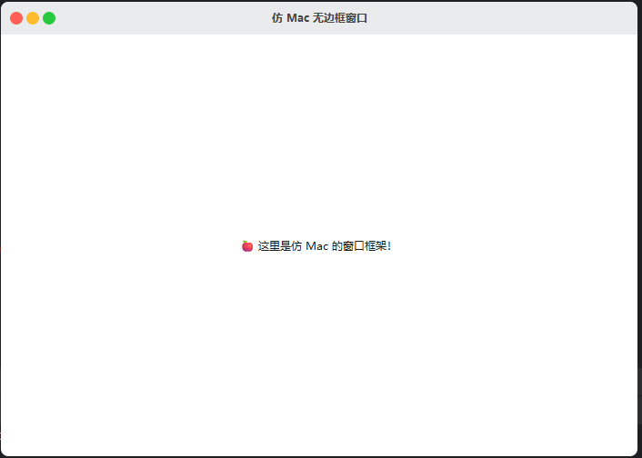
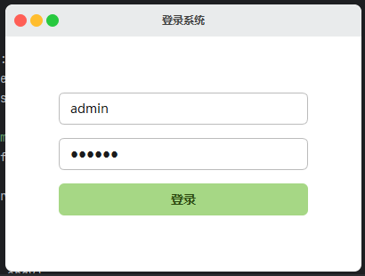

# 🍎 MacStyleWindow（PySide6 自定义无边框窗口）

> 基于 PySide6 实现的 macOS 风格无边框窗口组件，支持窗口拖动、缩放、动画最大化、圆角 UI、自定义标题栏按钮等功能。已内置多个 Demo 示例，方便快速上手。

---

## ✨ 功能特性

- 🍏 仿 macOS 风格窗口：无边框 + 圆角设计 + 三色控制按钮
- 🖱️ 支持窗口拖动与边缘缩放（内置方向识别与鼠标样式）
- 🌀 最大化与还原动画切换（平滑过渡，提升体验）
- 🧱 支持注入自定义界面布局（`setContentLayout()`）
- 🧼 使用 QSS 自定义样式，便于定制主题风格
- 📦 示例丰富，适用于真实应用开发

---

## 📦 示例演示（Demo）

| 文件名      | 示例说明                      |
|-------------|-------------------------------|
| `demo1_hello.py`  | 基础欢迎窗口，演示窗口拖动、动画、样式 |
| `demo2_login.py`  | 简易登录窗口，包含输入框与按钮          |
| `demo3_todo.py`   | 待办事项管理应用，含右键菜单、自定义输入框 |

### demo01_hello.py



### demo2_login.py



### demo3_todo.py


---

## 🚀 快速开始

### 1. 安装依赖

本项目基于 [PySide6](https://doc.qt.io/qtforpython/)：

```bash
pip install PySide6
